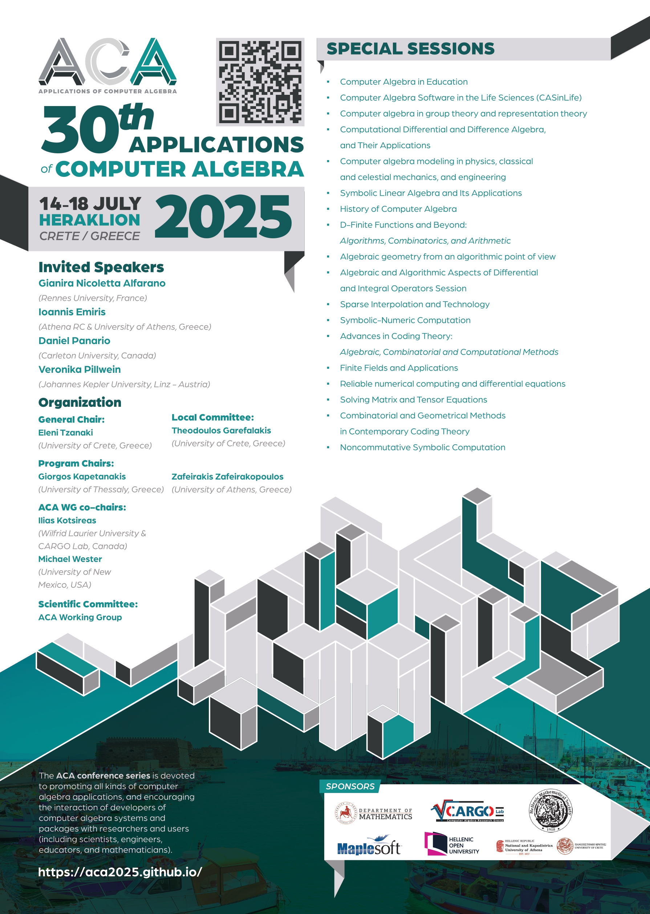

It seems like the [ACA 2025](https://aca2025.github.io/) conference turned out to be vastly successful. Not only it was the largest conference in the [series](https://math.unm.edu/aca.html) in terms of numbers, but also, from the participants' feedback, also in terms of the quality of the talks and the overall organization. The people behind this success are

* [Eleni Tzanaki](https://sites.google.com/view/tzanakel/),
* [Zafeirakis Zafeirakopoulos](https://zafeirakopoulos.github.io/),
* [Giorgos Kapetanakis](https://gkapet.users.uth.gr/),
* [Theodoulos Garefalakis](http://users.math.uoc.gr/~tgaref/),
* [Ilias Kotsireas](https://web.wlu.ca/science/physcomp/ikotsireas/),
* [Michael Wester](https://math.unm.edu/~wester/homepage.html).

Of course, we were very lucky to have an amazing group of volunteers, special session organizers, speakers and, of course, participants!

{:width="100%"}
